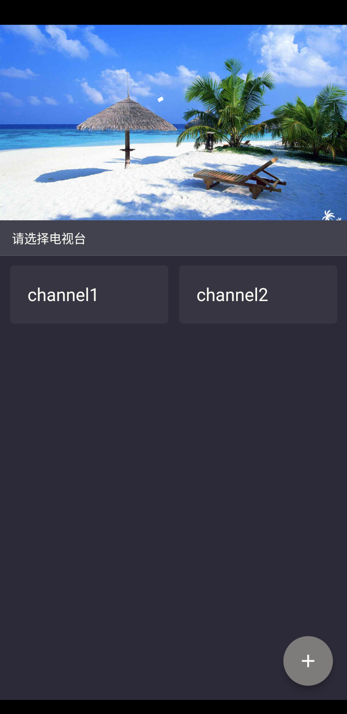
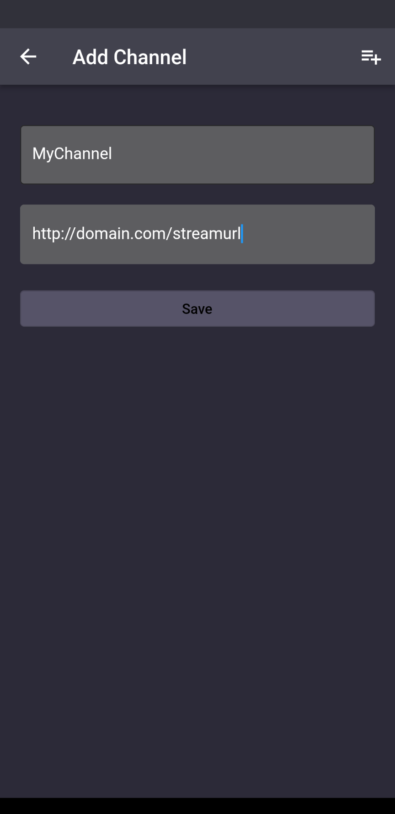

# WatchTV

Watch your live stream with WatchTV app. This app DOES NOT provide any live stream content.

## Getting Started

Add a live stream channel to this app and start watching.

## Tech stack

* [Flutter](https://flutter.dev/)
* [GetX](https://pub.dev/packages/get)
* [fijkplayer](https://github.com/befovy/fijkplayer)
* [sqflite](https://pub.dev/packages/sqflite)

The logo is downloaded from [flaticon](https://www.flaticon.com/)

## Roadmap

- [ ] support TV / tablet

- [ ] support Dark and Light Mode

- [ ] support m3u file