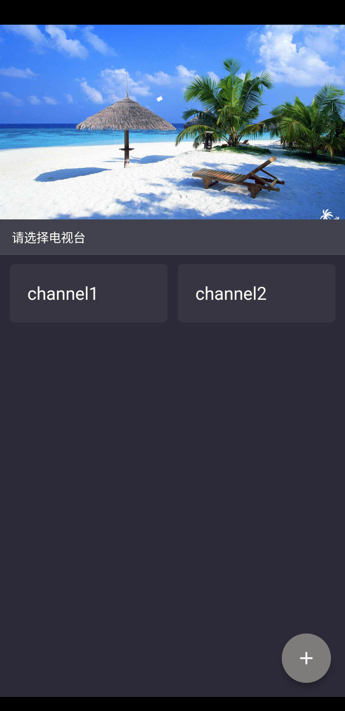
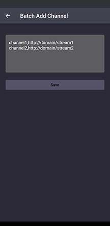
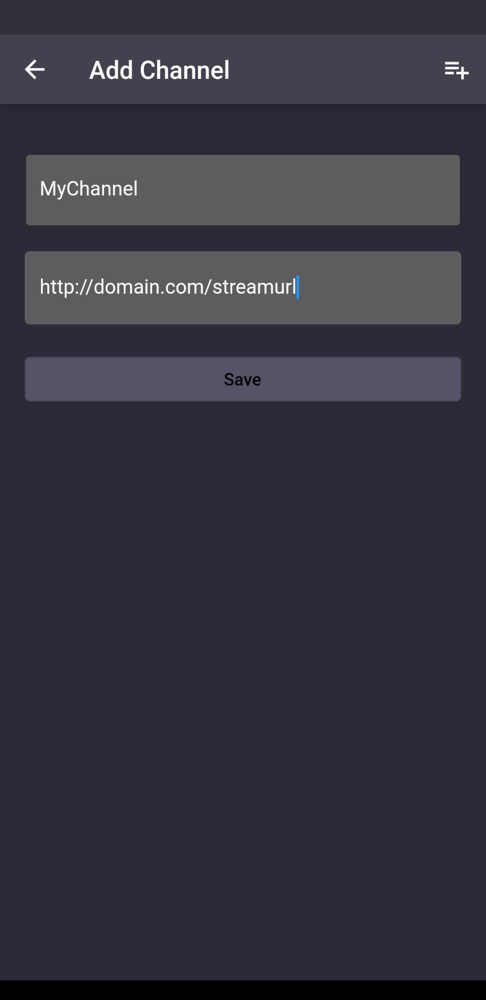

# WatchTV

[](https://github.com/wugq/watch_tv_app/actions/workflows/ci.yml)

Watch your live stream with WatchTV app. This app DOES NOT provide any live stream content.

## Getting Started

Add a live stream channel to this app and start watching.

| Main Screen                                              | Add multiple Channels                                    | Add a channel                                            |
|:--------------------------------------------------------:|:--------------------------------------------------------:|:--------------------------------------------------------:|
|  |  |  |

## Finding channels

* **Favorites**: tap the star next to a channel. Favorites have their own
  section and are shown first when the app starts.
* **Recently watched**: the last 30 channels you played.
* **My categories**: categories you make yourself and fill with channels
  you pick ("Add to category" in a channel menu, or select channels in the
  library).
* **Categories**: from the playlist (`group-title` or `#genre#`). A
  `group-title` such as `Kids;Music` puts the channel in both categories.
* **Search**: by channel name or category.

Large playlists can be trimmed without deleting anything: hide the
categories you do not watch, or single channels ("Hide" in a channel menu,
or the eye in the library). Hidden channels stay in the library and can be
shown again at any time; favorites and your own categories keep showing
channels from hidden categories.

On wide screens (desktop, tablets, phones in landscape) the video fills the
window. Move the pointer to the left edge (or use the channels button in the
control bar) to open the menu over the video: a sidebar with the sections.
Pointing at a section opens a second panel with its channels, like a start
menu; clicking a section keeps the panel open. The full screen button makes
the video fill the whole screen with the same menu.

The control bar at the bottom has play / pause, previous / next channel,
volume, the next source and favorite buttons, and a seek bar for streams
with a fixed length. With a mouse, a click on the video pauses or plays and
a double click toggles full screen.

On phones, section chips sit above the channel list, and the grid button
opens all sections in a sheet.

## Adding channels

**Add playlist** is the main way to add channels:

* **URL**: an M3U or TXT playlist on the web. URL playlists can be refreshed
  later from the library.
* **File**: an M3U or TXT file on the device.
* **Paste**: playlist text.

M3U playlists use `group-title` as the category. TXT format, one source per
line:

```text
News,#genre#
Channel A, https://example.com/a.m3u8
Channel A, https://backup.example.com/a.m3u8
Channel B, https://example.com/b.m3u8#https://backup.example.com/b.m3u8
```

* A `Category,#genre#` line sets the category of the lines after it.
* Several URLs on one line can be separated by `#`.

A single channel can also be added by hand (library, Channels tab, Add
channel).

## Library

The library page (video library icon) manages what you added:

* **Playlists**: refresh (URL playlists), rename, delete. Deleting a playlist
  removes its sources; channels left without sources are deleted.
* **Categories**: your own categories (create, rename, delete) and a switch
  per playlist category to show or hide it, plus "Show all" / "Hide all".
* **Channels**: filter (all, hidden, a category), search, show or hide with
  the eye, star, edit, delete. Long-press to select several channels and
  hide, show, add to a category or delete them together.

The channel editor lists all sources of a channel: add a URL, edit one
(including its HTTP headers), remove one, or move one up so it is tried
earlier. It also has the delete button.

## HTTP headers

Some streams only play with a certain `User-Agent` or `Referer`. They are
read from the playlist and sent with every request of that source:

* M3U attributes `http-user-agent="..."` and `http-referrer="..."`
* `#EXTVLCOPT:http-user-agent=...` and `#EXTVLCOPT:http-referrer=...` lines
* `URL|User-Agent=...&Referer=...` (M3U and TXT, values may be
  percent-encoded)

Playlists imported before this version get their headers on the next
refresh.

## Multiple sources

Lines with the same channel name become one channel with several sources.
Importing a channel that already exists appends the new sources (duplicates
are skipped). When a source fails, does not start within 20 seconds, or
buffers for 20 seconds, the player tries the next one. The source button in
the player (`1/3`) switches sources by hand.

Plain `http://` streams are allowed: `android:usesCleartextTraffic="true"` on
Android and `NSAllowsArbitraryLoadsForMedia` (media playback only) on iOS and macOS.

## Platforms

| Platform | Video | Database |
|---|---|---|
| Android | video_player (ExoPlayer) | sqflite |
| iOS | video_player (AVPlayer) | sqflite |
| macOS | video_player (AVPlayer) | sqflite |
| Windows | video_player + [video_player_media_kit](https://pub.dev/packages/video_player_media_kit) (libmpv) | sqflite_common_ffi |
| Linux | video_player + video_player_media_kit (libmpv) | sqflite_common_ffi |

The backends are chosen in `lib/core/platform.dart`, so the rest of the app
only uses the `video_player` API.

On desktop the database is stored in the application support directory
(for example `~/.local/share/dev.wugq.tv/` on Linux).

### Linux build requirements

```sh
sudo apt install clang cmake ninja-build pkg-config libgtk-3-dev libmpv-dev mpv
```

The media_kit Linux plugin downloads the mimalloc source from GitHub during
the CMake step.

### Windows

media_kit downloads prebuilt libmpv binaries during the build.

### Keyboard (desktop)

| Key | Action |
|---|---|
| Space | Play / pause |
| F | Full screen |
| Esc | Close the menu, exit full screen |
| C | Show / hide the channel menu |
| M | Mute / unmute |
| Up / Down | Previous / next channel |
| S | Next source |

## Tech stack

* [Flutter](https://flutter.dev/) 3.47 (Dart 3.13), Material 3 with light and dark theme
* [GetX](https://pub.dev/packages/get) for routing, dependency injection and state
* [video_player](https://pub.dev/packages/video_player) (ExoPlayer on Android, AVPlayer on iOS)
* [sqflite](https://pub.dev/packages/sqflite)
* [wakelock_plus](https://pub.dev/packages/wakelock_plus)
* [file_picker](https://pub.dev/packages/file_picker) and [http](https://pub.dev/packages/http) for playlist import
* [media_kit](https://pub.dev/packages/media_kit) via video_player_media_kit (Windows, Linux)
* [window_manager](https://pub.dev/packages/window_manager) for desktop full screen

## Project structure

```text
lib/
  main.dart                 opens the database, registers ChannelRepository
  app/                      app widget, theme, routes and bindings
  core/                     helpers, platform setup (video / database backends, full screen)
  data/
    models/                 Channel, StreamSource, Playlist, CustomCategory
    sources/                sqflite database (schema v4), playlist loader (file / URL)
    repositories/           ChannelRepository (interface + sqflite implementation)
    parsers/                channel list / M3U parser
  features/
    player/                 PlayerController (video_player wrapper) and PlayerView
    home/                   HomeController, HomePage, desktop menu, phone browser
    channel_editor/         add / edit one channel and its sources
    playlist_import/        add a playlist from a URL, file or text
    manage/                 library: playlists and channels
```

Controllers get their dependencies through the constructor, so tests use an
in-memory repository and a fake player (`test/helpers/fakes.dart`).

## Development

```sh
flutter pub get
flutter analyze
flutter test
flutter run
```

## CI

`.github/workflows/ci.yml` runs format check, `flutter analyze` and
`flutter test`, then builds Android (APK), Linux, Windows, macOS (unsigned)
and iOS (compile only, no codesign). Builds are uploaded as workflow
artifacts.

The logo is downloaded from [flaticon](https://www.flaticon.com/)

## Roadmap

- [x] support tablet (side-by-side layout on wide screens)

- [ ] LG webOS TV app with remote control navigation, see [docs/backlog.md](docs/backlog.md)

- [x] support desktop (macOS, Windows, Linux)

- [x] support Dark and Light Mode

- [x] support m3u / txt playlist (paste, file, URL)

- [x] multiple sources per channel with automatic fallback

- [x] refresh imported playlists from their URL

- [x] favorites, recently watched, search

- [x] hide channels and categories, custom categories

- [x] User-Agent / Referrer per source

- [ ] refresh URL playlists automatically
